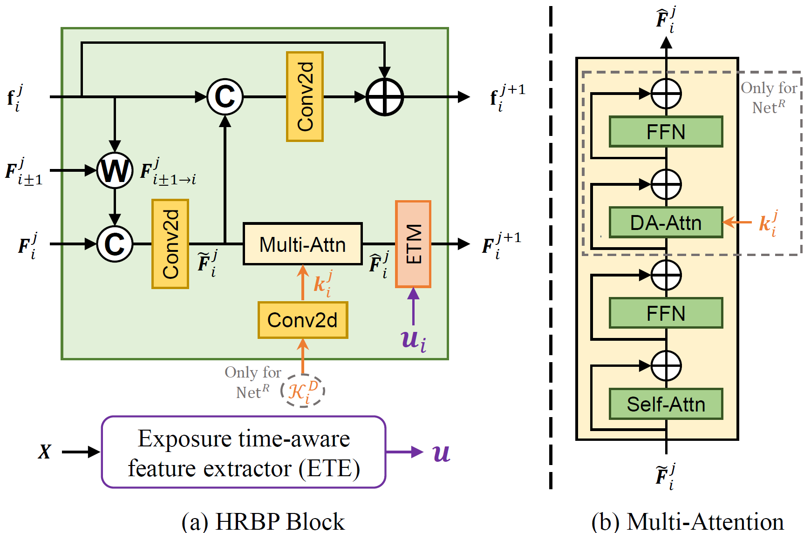

<h2>FMA-Net++</h2>

&nbsp;&nbsp;
    <a href='https://sites.google.com/view/geunhyukyouk/' target='_blank'>Geunhyuk Youk</a>1&nbsp;
    <a href='https://sites.google.com/view/ozbro/' target='_blank'>Jihyong Oh</a>† 2&nbsp;
    <a href='https://www.viclab.kaist.ac.kr/' target='_blank'>Munchurl Kim</a>† 1

    1Korea Advanced Institute of Science and Technology (KAIST), South Korea

    2Chung-Ang University, South Korea

    †Co-corresponding authors

 

    <h4 align="center">
        
        
        
    </h4>

---

    <h4>
        This repository is the official implementation of "FMA-Net++: Motion- and Exposure-Aware Real-World Joint Video Super-Resolution and Deblurring".
    </h4>

https://github.com/user-attachments/assets/eaccd9eb-32ff-463f-af85-4c5cf52cace3

    

        For interactive comparisons, please visit our <a href="https://kaist-viclab.github.io/fmanetpp_site/">Project Page</a>.
    

## 📧 News
- **Dec 04, 2025:** This repository is created.

## 🧬 Previous Work
**FMA-Net++** builds upon our previous work, <a href="https://github.com/KAIST-VICLab/FMA-Net">FMA-Net</a> (CVPR 2024), addressing its limitations in handling **dynamic exposure** and **limited temporal receptive fields**.

## 📖 Abstract
Real-world video restoration is plagued by complex degradations from motion coupled with dynamically varying exposure—a key challenge largely overlooked by prior works. We present **FMA-Net++**, a framework for joint video super-resolution and deblurring (VSRDB) that explicitly models this coupled effect.

FMA-Net++ adopts a sequence-level architecture built from **Hierarchical Refinement with Bidirectional Propagation (HRBP)** blocks for parallel, long-range temporal modeling. It incorporates an **Exposure Time-aware Modulation (ETM)** layer and an **exposure-aware Flow-Guided Dynamic Filtering (FGDF)** module to infer physically grounded degradation kernels. Extensive experiments on our proposed **REDS-ME** and **REDS-RE** benchmarks demonstrate that FMA-Net++ achieves state-of-the-art performance.

## 🖼️ Method Overview

FMA-Net++ utilizes **HRBP** blocks for efficient temporal modeling and **ETM** layers to explicitly handle dynamic exposure changes.

    

 

    

## 🚀 Code Release Plan
**The full code and pretrained models will be released soon.**

- [ ] Inference code
- [ ] Pretrained models
- [ ] Training scripts
- [ ] Dataset generation scripts

## 📬 Contact
**For any questions, please contact rmsgurkjg@kaist.ac.kr via email.**