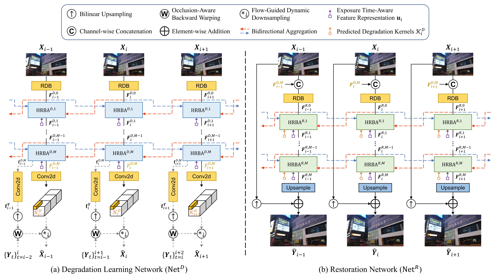
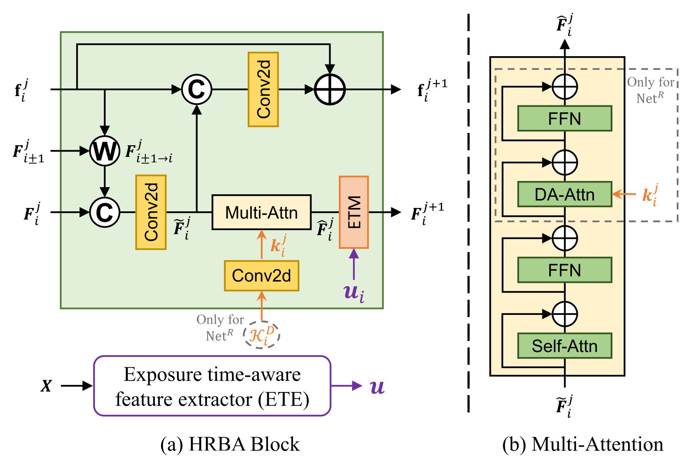

<div align="center">
<h2>FMA-Net++ (ECCV 2026)</h2>

<div>&nbsp;&nbsp;
    <a href='https://sites.google.com/view/geunhyukyouk/' target='_blank'>Geunhyuk Youk</a><sup>1</sup>&nbsp;
    <a href='https://sites.google.com/view/ozbro/' target='_blank'>Jihyong Oh</a><sup>† 2</sup>&nbsp;
    <a href='https://www.viclab.kaist.ac.kr/' target='_blank'>Munchurl Kim</a><sup>† 1</sup>
</div>
<div>
    <sup>1</sup>Korea Advanced Institute of Science and Technology (KAIST), South Korea
</div>
<div>
    <sup>2</sup>Chung-Ang University, South Korea
</div>
<div>
    <sup>†</sup>Co-corresponding authors
</div>
</div>

<div>
    <h4 align="center">
        <a href="https://kaist-viclab.github.io/fmanetpp_site/" target='_blank'>
        
        </a>
        <a href="https://arxiv.org/abs/2512.04390" target='_blank'>
        
        </a>
        
    </h4>
</div>

---

<div align="center">
    <h4>
        This repository is the official implementation of "FMA-Net++: Motion- and Exposure-Aware Joint Video Super-Resolution and Deblurring".
    </h4>
</div>

https://github.com/user-attachments/assets/eaccd9eb-32ff-463f-af85-4c5cf52cace3

<div align="center">
    <p>
        👆 <b>Experience User-Interactive Comparisons:</b> Please visit our <a href="https://kaist-viclab.github.io/fmanetpp_site/"><b>Project Page</b></a> to explore more results.
    </p>
</div>

## 📧 News
- **June 18, 2026:** FMA-Net++ is accepted to **ECCV 2026** 🎉
- **Dec 04, 2025:** This repository is created.

## 🧬 Previous Work
**FMA-Net++** builds upon our previous work, <a href="https://github.com/KAIST-VICLab/FMA-Net">FMA-Net</a> (CVPR 2024), addressing its limitations in handling **dynamic exposure** and **limited temporal receptive fields**.

## 📖 Abstract
Joint video super-resolution and deblurring (VSRDB) aims to restore sharp, HR videos from blurry, LR inputs. A key difficulty is that the exposure duration often varies across frames, changing the extent of motion blur throughout a video. Most existing methods assume a fixed exposure and rely on sliding-window or recurrent designs, which struggle to efficiently capture long-range temporal context under such frame-wise exposure variation.

We present **FMA-Net++**, a non-recurrent, sequence-level framework built from **Hierarchical Refinement with Bidirectional Aggregation (HRBA)** blocks that process frames in parallel while hierarchically expanding the temporal receptive field. To handle exposure-dependent blur, an **Exposure Time-aware Modulation (ETM)** layer conditions features on per-frame exposure embeddings from an **Exposure Time-aware Feature Extractor (ETE)**, guiding an exposure-aware dynamic filtering module to estimate motion- and exposure-aware degradation kernels. Trained solely on synthetic data, FMA-Net++ achieves state-of-the-art accuracy and temporal consistency on our proposed **REDS-ME** and **REDS-RE** benchmarks, and generalizes well to GoPro and challenging real-world videos.

## 🖼️ Method Overview

FMA-Net++ utilizes **HRBA** blocks for efficient temporal modeling and **ETM** layers to explicitly handle dynamic exposure changes.

<div align="center">
    
</div>
<br>
<div align="center">
    
</div>

## 🚀 Code Release Plan
**The full code and pretrained models will be released soon.**

- [ ] Inference code
- [ ] Pretrained models
- [ ] Training scripts
- [ ] Dataset generation scripts

## 📑 Citation
If you find FMA-Net++ useful, please consider citing:
```BibTeX
@inproceedings{youk2026fmanetpp,
    author    = {Youk, Geunhyuk and Oh, Jihyong and Kim, Munchurl},
    title     = {FMA-Net++: Motion- and Exposure-Aware Joint Video Super-Resolution and Deblurring},
    booktitle = {European Conference on Computer Vision (ECCV)},
    year      = {2026}
}
```

## 📬 Contact
**For any questions, please contact rmsgurkjg@kaist.ac.kr via email.**